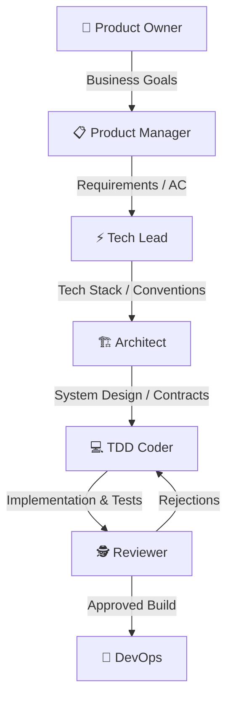

# Role-Based Multi-Agent SDLC Concept 🤖👥

This directory contains the rules, permissions, and handoff protocols for a simulated role-based multi-agent development team. The goal of this framework is to partition the Software Development Life Cycle (SDLC) into specialized agent personas, ensuring modular design, strict code reviews, and high-quality outcomes.

---

## 🎭 The Agent Team Personas

Each agent operates within a restricted scope to prevent context contamination and ensure clean division of labor:

1. **[👑 00_PO_RULES.md](./00_PO_RULES.md)**: Product Owner (Business Visionary). Establishes the "What" and "Why" of features. Modifies `docs/BUSINESS_GOALS.md`.
2. **[📋 01_PM_RULES.md](./01_PM_RULES.md)**: Product Manager & UX Strategist. Maps user flow and establishes functional logic. Modifies `docs/REQUIREMENTS.md` and `docs/USER_JOURNEY.md`.
3. **[⚡ 02_TECH_LEAD_RULES.md](./02_TECH_LEAD_RULES.md)**: Technical Lead. Conducts feasibility checks and decides the framework stack. Modifies `docs/TECH_STACK.md`.
4. **[🏗️ 03_ARCHITECT_RULES.md](./03_ARCHITECT_RULES.md)**: System Architect. Models databases, class hierarchies, and API routes. Modifies `docs/SYSTEM_DESIGN.md`.
5. **[💻 04_CODER_RULES.md](./04_CODER_RULES.md)**: TDD Engineer. Writes failing unit tests first, then creates implementation code to pass them. Operates in `src/` and `tests/`.
6. **[🕵️ 05_REVIEWER_RULES.md](./05_REVIEWER_RULES.md)**: Reviewer (QA & Auditor). Conducts static audits and validates tests against requirements. Logs audits in `docs/REVIEWS.md`.
7. **[🚀 06_DEVOPS_RULES.md](./06_DEVOPS_RULES.md)**: DevOps Engineer. Sets up Docker environments, pipelines, and health monitors. Operates in `.github/` and scripts.

---

## 🤝 Collaboration & Handoffs

To maintain alignment, the team uses a central state tracker: **[STATUS.md](../STATUS.md)**.
* When an agent finishes their stage, they check off their status in `STATUS.md`.
* They then log their handoff notes and ping the next agent in the sequence.
* If a bug is caught during review, the Reviewer logs the regression in `docs/REVIEWS.md` and triggers a rollback of the checkpoint in `STATUS.md`, handing back to the Coder.
