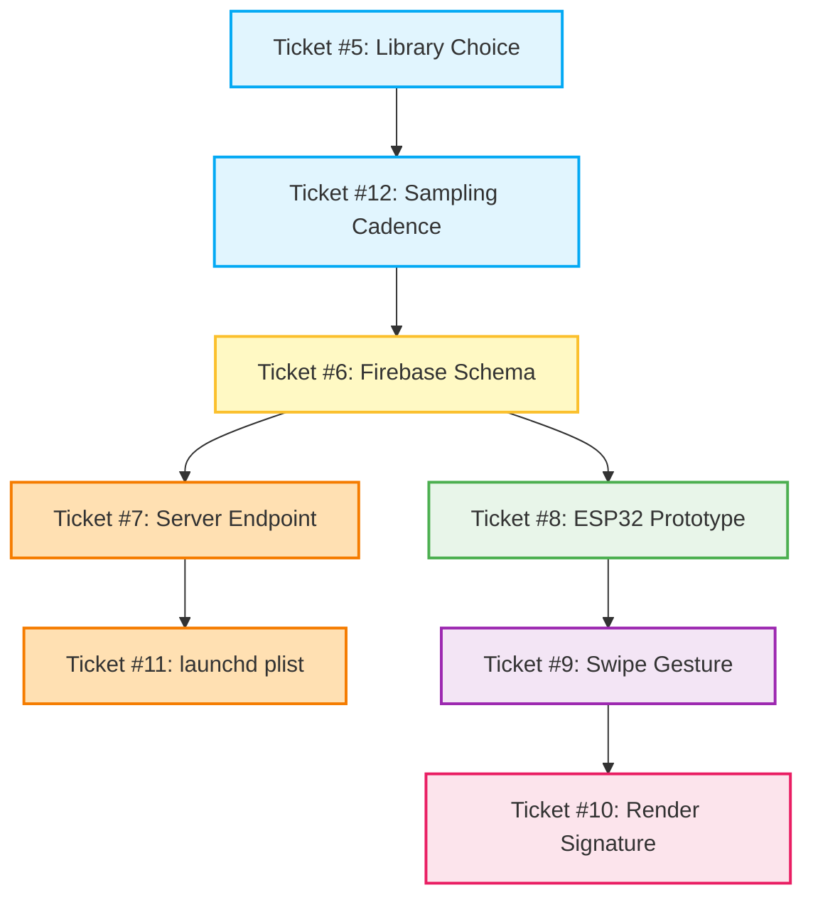

# macOS System Monitor Implementation Plan

## Executive Summary
This document outlines the implementation plan for the Mac System Monitor feature. The feature enables the ESP32 companion display to fetch, track, and render real-time macOS system statistics (CPU, memory, network bandwidth, CPU temperature, and battery percentage) in a new page. The architecture utilizes a lightweight macOS daemon that samples local statistics every 2 seconds, posts them to the central node server, which then consolidates the metrics with existing AI token quotas and updates a Firebase Realtime Database path (`/display/snapshot.json`). The ESP32 companion display fetches this snapshot, parses the 60-sample historical arrays, handles page navigation using horizontal swipe gestures, and draws the data on a custom UI.

This plan emphasizes a **testing-first sequence** to decouple data-contract verification from hardware deployment, ensuring all backend routes, data validation rules, and Firebase schemas are fully validated via mock payloads before hardware flashing or launchd daemon activation.

## Dependency and Implementation Sequence Diagram
Here is a visual map of the technical dependencies and execution flow for the 8 implementation tickets:



### Blocking Dependency Rules:
1. **Core Data Contract First (Ticket #6)**: The Firebase schema structure defines the payload shapes flowing between all other systems. It blocks the server endpoint (Ticket #7) and ESP32 parser (Ticket #8).
2. **Server Before Client (Ticket #7)**: Having a functional `POST /api/mac` endpoint ensures the database holds valid, live data before the ESP32 (Ticket #8) tries to poll it.
3. **Daemon Core Before launchd (Tickets #5 & #12 -> Ticket #11)**: Metrics capturing and ring buffer management must be fully validated in a manual Node process before installing background auto-start files.
4. **Parsing and Navigation Before Rendering (Tickets #8 & #9 -> Ticket #10)**: ESP32 data ingestion and touch-gesture transitions must be implemented first to enable navigation and data population on the UI rendering screen.

---

## Detailed Breakdown of Tickets

### Ticket #5: Library Choice
- **Scope**: Choose and implement the metrics-gathering strategy in the macOS daemon for CPU load, memory usage, network bandwidth, CPU temperature, and battery stats in Node.js.
- **Files Modified/Added**: `mac/mac-monitor.js`
- **Technical Rationale**:
  - `systeminformation` is a third-party dependency not currently in `package.json`. On macOS, it is a thin wrapper that spawns subprocesses (`vm_stat`, `netstat`, `pmset`) anyway, adding no real benefit but introducing external dependency weight.
  - Furthermore, `systeminformation` cannot retrieve CPU temperature on Apple Silicon without optional native packages (`macos-temperature-sensor` / `osx-temperature-sensor`) that compile via `node-gyp`. Native compilation violates the "no native compilation" constraint.
  - Using stock tools like `powermetrics` for CPU temperature requires root privileges (`sudo`), violating the "no sudo" constraint.
  - Therefore, the project will **stay dependency-free**. The daemon will use built-in Node `child_process` modules to invoke stock macOS CLI utilities.
  - CPU temperature will be hardcoded to `null` to comply with the "no sudo" and "no native compilation" constraints.
- **Implementation Details**:
  - **CPU load**: Run `top -l 1` and extract `CPU usage` percentages (`100 - idle_percentage`). Alternatively, parse `os.cpus()` diffs across ticks if avoiding spawn overhead.
  - **Memory usage**: Run `vm_stat` and parse pages free, active, inactive, wired, and compressor. Compute totals using the page size extracted from the output header (e.g. 16384 bytes on Apple Silicon). Optionally query `sysctl vm.memory_pressure` to monitor memory pressure.
  - **Network bandwidth**: Run `netstat -ib`, parse cumulative input/output bytes (`Ibytes` and `Obytes`) on the active link interface, and divide by the time elapsed between samples to calculate rates.
  - **Battery**: Run `pmset -g batt` and parse the battery percentage and state keywords (`charging`, `discharging`, `AC attached; not charging`, `charged`).

### Ticket #6: Firebase Schema
- **Scope**: Redefine the Firebase database structure to host a unified snapshot under `/display/snapshot.json` consolidating brand quotas and Mac system statistics.
- **Files Modified/Added**: `database.rules.json` (if present), database configuration files.
- **Implementation Details**:
  - Merge existing brand nodes (`gemini`, `claude`, `minimax`, `glm`) and the new `mac` node under the single path `/display/snapshot.json`.
  - The `mac` object layout must be structured as follows:
    ```json
    {
      "mac": {
        "last_seen": 1720980000000,
        "online": true,
        "timestamp": 1720980000000,
        "current": {
          "cpu": 45.2,
          "memory": { "used": 12, "total": 16, "percent": 75 },
          "network": { "down": 120, "up": 45 },
          "temperature": null,
          "battery": { "percent": 85, "charging": true }
        },
        "history": {
          "cpu": [{ "t": 1720979940000, "v": 42.1 }, ...],
          "memory": [{ "t": 1720979940000, "v": 74 }, ...],
          "network_down": [{ "t": 1720979940000, "v": 115 }, ...],
          "network_up": [{ "t": 1720979940000, "v": 42 }, ...],
          "temperature": [],
          "battery": [{ "t": 1720979940000, "v": 84 }, ...]
        }
      }
    }
    ```
  - History buffers will hold exactly 60 entries of `{ t: timestamp, v: value }` objects.
  - Update security rules to permit reads on `/display/snapshot` and restrict writes to authorized server tokens/credentials.

### Ticket #7: Server Endpoint
- **Scope**: Implement the `POST /api/mac` endpoint in `server.js`, validate incoming payloads, merge with brand quotas, check for daemon staleness, and write the merged snapshot to Firebase.
- **Files Modified/Added**: `server.js`
- **Implementation Details**:
  - Add the `POST /api/mac` route.
  - Validate that the payload has the fields `timestamp`, `current`, and `history`, and that `current.cpu` falls between 0 and 100.
  - Store the incoming data in global server variables (`macData` and `lastMacUpdate = Date.now()`).
  - Modify `publishSnapshot()` to fetch brand quotas, compute `online` status using the condition `(Date.now() - lastMacUpdate) < 10000` (10 seconds threshold), merge the data structures, and publish the result to `/display/snapshot.json`.
  - Add a periodic check (or run a check inside `publishSnapshot`) that automatically triggers a republish with `online: false` if no POST requests are received within the 10-second window.

### Ticket #8: ESP32 Prototype
- **Scope**: Update firmware to fetch the consolidated snapshot, parse the nested JSON (specifically the `mac` node current fields and history arrays), and populate local C data structures.
- **Files Modified/Added**: `firmware/esp32-display/esp32-display.ino`
- **Implementation Details**:
  - Declare C structs `MacSample`, `MacMetric`, and `MacData` to store metrics state in the ESP32 runtime.
  - Point the HTTPClient URL to `https://<FIREBASE_HOST>/display/snapshot.json/mac?auth=<FIREBASE_AUTH>`.
  - Use the `FirebaseJson` library to read JSON values. Parse `online`, `last_seen`, and nested metric variables (`current/cpu`, `current/memory/percent`, etc.).
  - Implement a helper function `parseHistoryArray(FirebaseJson &json, const char* path, MacMetric &metric)` that extracts `t` and `v` keys for each element in the array up to a maximum length of 60 to prevent heap memory exhaustion on the ESP32.

### Ticket #9: Swipe Gesture
- **Scope**: Update the screen touch logic to support switching display pages via horizontal swipe gestures.
- **Files Modified/Added**: `firmware/esp32-display/esp32-display.ino`
- **Implementation Details**:
  - Add `STATE_MAC` to the `DisplayState` enum.
  - Inside `handleTouch()`, record `touchStartX`, `touchStartY`, and `touchStartTime` on touch activation.
  - On touch release, if the duration is less than `LONG_PRESS_MS`, compute delta values `dx = tx - touchStartX` and `dy = ty - touchStartY`.
  - Trigger page transitions if `abs(dx) > 80` and `abs(dx) > abs(dy) * 2`.
  - Swipe Right (`dx > 0`): Cycle state: `STATE_OVERVIEW` -> `STATE_MAC` -> `STATE_SETTINGS`.
  - Swipe Left (`dx < 0`): Cycle state in reverse.
  - Trigger `renderCurrent()` immediately upon state transition to redraw the display.

### Ticket #10: Render Signature
- **Scope**: Write the screen graphics logic for the Mac page, including rows for the 5 metrics, relative sparklines, a battery level icon, and an offline overlay.
- **Files Modified/Added**: `firmware/esp32-display/esp32-display.ino`
- **Implementation Details**:
  - Implement `drawMacPage()` using the display framework.
  - If `!macDataFetched` or `!macData.online`, draw a clear, centered "Mac Offline" warning with a "Waiting for data..." secondary caption.
  - Render 5 stacked metric rows (spaced 56px apart starting at Y=50px) displaying titles, current values (formatted with units), and their sparklines.
  - Implement `drawSparkline()`:
    - Iterate through history array to locate minimum and maximum values.
    - Set the vertical range as `maxVal - minVal` (clamped to a minimum of 1.0 to prevent division by zero).
    - Map each history entry's value relative to this range to calculate screen coordinates.
    - Connect adjacent coordinates using `gfx->drawLine`.
  - Implement `drawBatteryIndicator()` at the bottom right. Render a battery outline with a terminal pin, fill the interior proportional to `macData.battery.current` (using green for >20% and red for <=20%), and render the numeric percentage. Only draw this indicator if battery current > 0.

### Ticket #11: launchd plist
- **Scope**: Create and install a plist file to ensure the macOS daemon runs continuously in the background.
- **Files Modified/Added**: `mac/com.ai-token-monitor.mac.plist`
- **Implementation Details**:
  - Define a plist layout referencing `/opt/homebrew/bin/node` (or target machine Node path) and the monitor script absolute path.
  - Set `<key>RunAtLoad</key><true/>` and `<key>KeepAlive</key><true/>` to maintain background execution.
  - Pipe output logs to `/Users/lifetofree/Library/Logs/ai-token-monitor.mac.log` and standard errors to `/Users/lifetofree/Library/Logs/ai-token-monitor.mac.error.log`.
  - Provide shell commands to load and unload the configuration via `launchctl`.

### Ticket #12: Sampling Cadence
- **Scope**: Implement the periodic sampling loop in `mac/mac-monitor.js`, maintain the 60-sample in-memory buffers, and handle posting data.
- **Files Modified/Added**: `mac/mac-monitor.js`
- **Implementation Details**:
  - Define a custom `RingBuffer` class with a capacity of 60 that automatically shifts out older records.
  - Establish a loop running every 2000ms using `setTimeout` / `async` helper blocks.
  - Maintain historical buffers for all metrics.
  - On each tick, gather system metrics, push them to the ring buffers, format the payload, and perform an HTTP POST request to the local server endpoint with a timeout signal of 5 seconds.

---

## Testing-First Recommended Implementation Order

To ensure high-quality software delivery and prevent integration bottlenecks, developers should adhere to this testing-first sequence:

1. **Step 1: Firebase Schema definition (Ticket #6)**
   - *Why first*: Forms the API contract. Writing mock structures verifies database read/write constraints.
2. **Step 2: Server API endpoint development (Ticket #7)**
   - *Why second*: Allows mocking of data ingestion. The endpoint can be tested via `curl` payloads without requiring any macOS daemon or ESP32 hardware.
3. **Step 3: Metrics library choice and loop logic (Tickets #5 & #12)**
   - *Why third*: Once the server ingestion endpoint is running and tested, the local daemon script can be developed and verified against it by launching it in a manual terminal process.
4. **Step 4: Daemon background service installation (Ticket #11)**
   - *Why fourth*: Once the daemon script is stable, register it with the macOS background system (`launchd`).
5. **Step 5: ESP32 Data parsing (Ticket #8)**
   - *Why fifth*: Decouples data ingestion from UI rendering. Validates C-struct parsing on the ESP32 via serial logs, eliminating screen draw complexity during debugging.
6. **Step 6: ESP32 Touch swipe navigation (Ticket #9)**
   - *Why sixth*: Allows navigation between screen states, printing transitions to the serial console.
7. **Step 7: ESP32 UI Rendering (Ticket #10)**
   - *Why seventh*: Finally implement the screen graphics, verifying coordinate ranges and offline state behaviors.

---

## Step-by-Step Verification Plan

For each of the 8 stages, use the following concrete verification procedures to confirm success before starting downstream tasks.

### Step 1: Firebase Schema (Ticket #6)
- **Objective**: Verify that the Firebase path and schema layout can accept the new consolidated format.
- **Verification Command**:
  Perform a direct `PUT` using `curl` to write a mock snapshot to your local Firebase Emulator or staging database:
  ```bash
  curl -X PUT \
    -H "Content-Type: application/json" \
    -d '{
      "gemini": { "name": "Gemini", "remaining": 85, "limit_value": 100, "weekly_remaining": 70 },
      "mac": {
        "last_seen": 1720980000000,
        "online": true,
        "timestamp": 1720980000000,
        "current": {
          "cpu": 45.2,
          "memory": { "used": 12, "total": 16, "percent": 75 },
          "network": { "down": 120, "up": 45 },
          "temperature": null,
          "battery": { "percent": 85, "charging": true }
        },
        "history": {
          "cpu": [{"t": 1720979940000, "v": 42.1}, {"t": 1720979942000, "v": 43.5}],
          "memory": [{"t": 1720979940000, "v": 74}, {"t": 1720979942000, "v": 75}],
          "network_down": [{"t": 1720979940000, "v": 115}, {"t": 1720979942000, "v": 120}],
          "network_up": [{"t": 1720979940000, "v": 42}, {"t": 1720979942000, "v": 45}],
          "temperature": [],
          "battery": [{"t": 1720979940000, "v": 84}, {"t": 1720979942000, "v": 85}]
        }
      }
    }' \
    "http://127.0.0.1:9000/display/snapshot.json?auth=test-token"
  ```
- **Validation Criteria**: The write must complete with HTTP `200` without schema parsing errors or write-permission rejections.

### Step 2: Server Endpoint (Ticket #7)
- **Objective**: Verify endpoint ingestion, body validation, and state merging.
- **Verification Commands**:
  1. Start the server (default port `3838`).
  2. Send a valid payload:
     ```bash
     curl -i -X POST http://127.0.0.1:3838/api/mac \
       -H "Content-Type: application/json" \
       -d '{"timestamp":1720980000000,"current":{"cpu":50.5,"memory":{"used":8,"total":16,"percent":50},"network":{"down":100,"up":30},"temperature":null,"battery":null},"history":{"cpu":[]}}'
     ```
     *Expected Output*: `200 OK` or `{"ok":true}`.
  3. Send an invalid payload (e.g. invalid CPU range):
     ```bash
     curl -i -X POST http://127.0.0.1:3838/api/mac \
       -H "Content-Type: application/json" \
       -d '{"timestamp":1720980000000,"current":{"cpu":-15,"memory":{"used":8,"total":16,"percent":50},"network":{"down":100,"up":30},"temperature":null},"history":{}}'
     ```
     *Expected Output*: `400 Bad Request` explaining validation failures.
  4. Test staleness logic: Post a valid payload. Verify Firebase shows `"online": true`. Wait 10.5 seconds without posting. Query Firebase and verify that `"online"` is updated to `false`.

### Step 3: Library Choice & Sampling Cadence (Tickets #5 & #12)
- **Objective**: Verify that the daemon correctly polls macOS metrics and populates the 60-sample buffers.
- **Verification Method**:
  1. Add verbose local logs to the daemon script:
     ```javascript
     console.log(`[DAEMON] CPU: ${metrics.cpu}%, Mem: ${metrics.memory.percent}%, Net: D=${metrics.network.down} U=${metrics.network.up}, Temp: ${metrics.temperature}`);
     ```
  2. Execute the script manually: `node mac/mac-monitor.js`.
  3. Verify that CPU, memory, network, and battery outputs print correctly, while CPU temperature prints as `null` or is omitted.
  4. Monitor logs over a 2-minute period. Verify that the history arrays in the POST payload payloads scale up to exactly 60 samples and cap at that size.

### Step 4: Daemon launchd Configuration (Ticket #11)
- **Objective**: Verify that the launchd plist successfully daemonizes the Node process.
- **Verification Commands**:
  1. Load the plist agent:
     ```bash
     launchctl load -w ~/Library/LaunchAgents/com.ai-token-monitor.mac.plist
     ```
  2. Verify that the background task is running:
     ```bash
     launchctl list | grep ai-token-monitor.mac
     ```
     Confirm the list shows a status of `0` or a stable active PID.
  3. Read the output logs:
     ```bash
     tail -n 20 ~/Library/Logs/ai-token-monitor.mac.log
     tail -n 20 ~/Library/Logs/ai-token-monitor.mac.error.log
     ```
     Verify that there are no runtime permissions or module resolution errors.

### Step 5: ESP32 Parsing (Ticket #8)
- **Objective**: Confirm that the ESP32 successfully parses nested JSON statistics and history arrays.
- **Verification Method**:
  Add serial print calls to the ESP32 parser function:
  ```cpp
  Serial.printf("[TEST] Mac parsed online: %s, CPU: %.1f\n", 
                macData.online ? "true" : "false", macData.cpu.current);
  Serial.printf("[TEST] History elements read: cpu_len=%d, mem_len=%d\n",
                macData.cpu.historyLen, macData.memory.historyLen);
  ```
  Flash the device and verify that correct metrics and history values are output to the Serial Monitor without triggers for stack overflow or memory leaks.

### Step 6: ESP32 Swipe Gesture Navigation (Ticket #9)
- **Objective**: Verify that touch gestures reliably navigate between pages.
- **Verification Method**:
  Add serial logging to the touch transition logic:
  ```cpp
  if (abs(dx) > 80 && abs(dx) > abs(dy) * 2) {
    Serial.printf("[TEST-TOUCH] Swipe Registered! DX: %d, DY: %d. Transition state: %d -> %d\n",
                  dx, dy, prevDisplayState, displayState);
  }
  ```
  Perform horizontal swipes on the screen and verify the state transitions match the prints on the Serial Monitor.

### Step 7: ESP32 UI Rendering (Ticket #10)
- **Objective**: Verify that sparklines, values, battery icons, and the offline screen render accurately.
- **Verification Method**:
  1. **Offline Screen**: Terminate the macOS daemon process. Wait 10 seconds. Verify the screen updates to display the "Mac Offline" splash screen.
  2. **Online Screen**: Restart the daemon. Verify that metric rows are drawn immediately.
  3. **Scale/MinMax Visuals**: Inject history arrays containing values ranging from small to large (e.g. CPU values from 1.0 to 99.0). Verify the sparkline coordinates scale correctly and do not overflow row boundaries.
  4. **Battery Icon**: Test a scenario with battery metrics present and one where it is `null` (e.g., simulated desktop). Confirm that the battery icon and text percentage are hidden if battery metrics are `null`.
